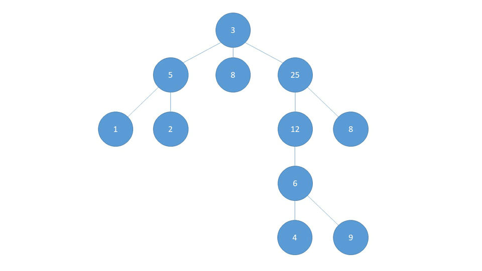

# Algorithme de Recherche Operationnelle - Intelligence Artificielle (Matlab)

La recherche opérationnelle est parmi les problématiques les plus répondues en IA classique. Dans ce projet, vous trouverez différentes implémentation des 3 algorithmes de recherche suivants: 

### &nbsp;&nbsp;&nbsp;&nbsp;&nbsp;&nbsp;1. [Algorithmes non-informés](https://github.com/Kamilbentounes/Algorithme-Recherche-Operationnelle-Intelligence-Artificielle#1-algorithmes-non-inform%C3%A9s-1)
### &nbsp;&nbsp;&nbsp;&nbsp;&nbsp;&nbsp;&nbsp;&nbsp;&nbsp;&nbsp;&nbsp;&nbsp; 1.A. [Breadth-First Search (BFS) - Recherche en largeur](https://github.com/Kamilbentounes/Algorithme-Recherche-Operationnelle-Intelligence-Artificielle#1a-breadth-first-search-bfs---recherche-en-largeur)
### &nbsp;&nbsp;&nbsp;&nbsp;&nbsp;&nbsp;&nbsp;&nbsp;&nbsp;&nbsp;&nbsp;&nbsp; 1.B. [Depth-First Search (DFS) - Recherche en profondeur](https://github.com/Kamilbentounes/Algorithme-Recherche-Operationnelle-Intelligence-Artificielle#1b-depth-first-search-dfs---recherche-en-profondeur)
### &nbsp;&nbsp;&nbsp;&nbsp;&nbsp;&nbsp; 2. [Algorithmes informés](https://github.com/Kamilbentounes/Algorithme-Recherche-Operationnelle-Intelligence-Artificielle#2-algorithmes-inform%C3%A9s)
### &nbsp;&nbsp;&nbsp;&nbsp;&nbsp;&nbsp;&nbsp;&nbsp;&nbsp;&nbsp;&nbsp;&nbsp; 2.A. [A star](https://github.com/Kamilbentounes/Algorithme-Recherche-Operationnelle-Intelligence-Artificielle#2a-a-star)

## 1. Algorithmes non-informés

Les algorithmes non-informés réalisent une recherche systématique et aveugle. Ces stratégies de recherches aveugles ne regardent pas les descriptions d'état, mais uniquement les positions des noeuds dans l'arbre de recherche, au contraire des stratégies de recherches heuristiques (infromés).

### 1.A. Breadth-First Search (BFS) - Recherche en largeur

À partir d'un nœud source S, cet algorithme liste d'abord les voisins de S pour ensuite les explorer un par un. Ce mode de fonctionnement utilise donc une file dans laquelle il prend le premier sommet et place en dernier ses voisins non encore explorés.

Les nœuds déjà visités sont marqués afin d'éviter qu'un même nœud soit exploré plusieurs fois. Dans le cas particulier d'un arbre, le marquage n'est pas nécessaire.

Étapes de l'algorithme :

* Mettre le nœud source dans la file.

* Retirer le nœud du début de la file pour le traiter.

* Mettre tous les voisins non explorés dans la file (à la fin).

* Si la file n'est pas vide reprendre à l'étape 2.

#### Exemple

Sur le graphe suivant, cet algorithme va alors fonctionner ainsi :

Il explore dans l'ordre les sommets A, B, C, E, D, F, G.
]Ici (https://github.com/Kamilbentounes/Algorithme-Recherche-Operationnelle-Intelligence-Artificielle/blob/master/Scripts-Codes/BFS.m)
#### Code

[Ici](https://github.com/Kamilbentounes/Algorithme-Recherche-Operationnelle-Intelligence-Artificielle/blob/master/Scripts-Codes/BFS.m), vous trouverez le script en Matlab de l'implémentation de l'algorithme BFS.

### 1.B. Depth-First Search (DFS) - Recherche en profondeur

L'exploration d'un parcours en profondeur depuis un sommet S fonctionne comme suit. Il poursuit alors un chemin dans le graphe jusqu'à un cul-de-sac ou alors jusqu'à atteindre un sommet déjà visité. Il revient alors sur le dernier sommet où on pouvait suivre un autre chemin puis explore un autre chemin (voir vidéo ci-contre). L'exploration s'arrête quand tous les sommets depuis S ont été visités. Bref, l'exploration progresse à partir d'un sommet S en s'appelant récursivement pour chaque sommet voisin de S.

Le nom d'algorithme en profondeur est dû au fait que, contrairement à l'algorithme de parcours en largeur, il explore en fait « à fond » les chemins un par un : pour chaque sommet, il marque le sommet actuel, et il prend le premier sommet voisin jusqu'à ce qu'un sommet n'ait plus de voisins (ou que tous ses voisins soient marqués), et revient alors au sommet père.

Si G n'était pas un arbre, l'algorithme pourrait a priori tourner indéfiniment si on continuait l'exploration depuis un sommet déjà visité. Pour éviter cela, on marque les sommets que l'on visite, de façon à ne pas les explorer à nouveau.

Dans le cas d'un arbre, le parcours en profondeur est utilisé pour caractériser l'arbre.

On notera qu'il est possible de l'implémenter itérativement à l'aide d'une pile LIFO contenant les sommets à explorer : on désempile un sommet et on empile ses voisins non encore explorés.

#### Exemple

Voici un exemple de parcours en profondeur:

#### Code

[Ici](https://github.com/Kamilbentounes/Algorithme-Recherche-Operationnelle-Intelligence-Artificielle/blob/master/Scripts-Codes/DFS.m), vous trouverez le script en Matlab de l'implémentation de l'algorithme DFS.

## 2. Algorithmes informés 

La recherche heuristique représente alors une technique alternative de résolution de problèmes en intelligence artificielle, largement utilisée pour les problèmes qui sont caractérisés par une explosion combinatoire d'états. Alors que les algorithmes non-informés réalisent une recherche systématique et 'aveugle', les techniques de recherche heuristique utilisent un ensemble de règles qui permettent d'évaluer la probabilité qu'un chemin allant du nœud courant au nœud solution soit meilleur que les autres. Cette information qui permet l'estimation des bénéfices des divers chemins avant les parcourir améliore, dans la plupart des cas, le processus de recherche.

### 2.A. A star

L'algorithme A* est un algorithme de recherche de chemin dans un graphe entre un nœud initial et un nœud final. Il utilise une évaluation heuristique sur chaque nœud pour estimer le meilleur chemin y passant, et visite ensuite les nœuds par ordre de cette évaluation heuristique. C'est un algorithme simple, ne nécessitant pas de prétraitement, et ne consommant que peu de mémoire.

A* commence à un nœud choisi. Il applique à ce nœud un « coût » (habituellement zéro pour le nœud initial). A* estime ensuite la distance qui sépare ce nœud du but à atteindre. La somme du coût et de l'évaluation représente le coût heuristique assigné au chemin menant à ce nœud. Le nœud est alors ajouté à une file d'attente prioritaire, couramment appelée open list.

L'algorithme retire le premier nœud de la file d'attente prioritaire (en raison du fonctionnement d'une file d'attente, le nœud à l'heuristique la plus basse est retiré en premier). Si la file d'attente est vide, il n'y a aucun chemin du nœud initial au nœud d'arrivée, ce qui interrompt l'algorithme. Si le nœud retenu est le nœud d'arrivée, A* reconstruit le chemin complet et s'arrête. Pour cette reconstruction on se sert d'une partie des informations sauvées dans la liste communément appelé closed list décrite plus bas.

Si le nœud n'est pas le nœud d'arrivée, de nouveaux nœuds sont créés pour tous les nœuds contigus admissibles ; la manière exacte de faire dépend du problème à traiter. Pour chaque nœud successif, A* calcule son coût et le stocke avec le nœud. Ce coût est calculé à partir de la somme du coût de son ancêtre et du coût de l'opération pour atteindre ce nouveau nœud.

L'algorithme maintient également la liste de nœuds qui ont été vérifiés, couramment appelée closed list. Si un nœud nouvellement produit est déjà dans cette liste avec un coût égal ou inférieur, aucune opération n'est faite sur ce nœud ni sur son homologue se trouvant dans la liste.

Après, l'évaluation de la distance du nouveau nœud au nœud d'arrivée est ajoutée au coût pour former l'heuristique du nœud. Ce nœud est alors ajouté à la liste d'attente prioritaire, à moins qu'un nœud identique dans cette liste ne possède déjà une heuristique inférieure ou égale.

Une fois les trois étapes ci-dessus réalisées pour chaque nouveau nœud contigu, le nœud original pris de la file d'attente prioritaire est ajouté à la liste des nœuds vérifiés. Le prochain nœud est alors retiré de la file d'attente prioritaire et le processus recommence.

Les deux structures open list et closed list ne sont pas nécessaires si on peut garantir que le premier chemin produit à n'importe quel nœud est le plus court. Cette situation surgit si l'heuristique est non seulement admissible mais aussi « monotone », signifiant que la différence entre l'heuristique de deux nœuds quelconques reliés ne surestime pas la distance réelle entre ces nœuds. Ce n'est possible que dans de très rares cas.
